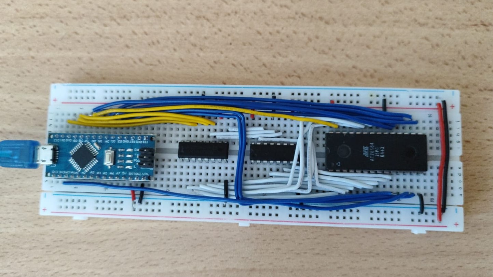
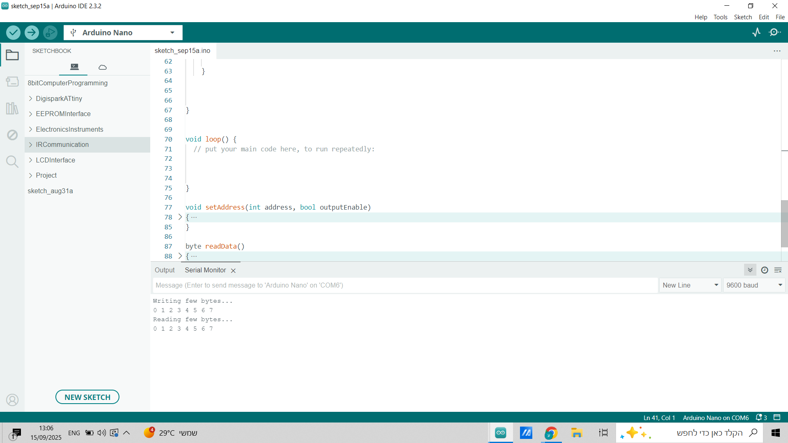

# 🧠 AT28C64 EEPROM Programmer using Arduino Nano

This project demonstrates a simple and low-cost way to program an **AT28C64 parallel EEPROM** using an **Arduino Nano** and two **74HC595 shift registers**. It writes and reads data from the EEPROM, showing the results in the Arduino Serial Monitor.

Because the Arduino Nano doesn’t have enough I/O pins to directly control all address and data lines, this design uses shift registers to expand its output capabilities.

---

## 📦 What's Included

- ✅ Real breadboard setup photo
- ✅ Serial Monitor output (write + read verification)
- ✅ Circuit schematic for easy wiring
- ✅ Arduino sketch for programming the EEPROM

---

## 🧱 1. Breadboard Setup

This is the actual physical circuit built on a breadboard. The Arduino Nano communicates with the EEPROM through two 74HC595 shift registers that handle the address lines.

> 💡 *Connect WE, OE, and CE control pins properly, and ensure pull-up/down resistors if needed.*

---

## 🧪 2. Serial Monitor Output

When the Arduino sketch is uploaded, it writes specific values to the EEPROM and reads them back to verify correct operation.

> 🔎 *This confirms the programmer successfully wrote and read data.*

---

## 📐 3. Schematic

This schematic shows all connections between the Arduino Nano, the 74HC595 shift registers, and the AT28C64 EEPROM.

---

## 💻 4. Arduino Code

The Arduino sketch is located at:

📁 [`code/eeprom-programmer.ino`](code/eeprom-programmer.ino)

### 📝 What it does:
- Sets up shift registers for addressing
- Writes test bytes to selected EEPROM addresses
- Reads back the data
- Verifies correctness in the Serial Monitor

You can modify the sketch to:
- Write more data
- Read full memory blocks
- Test specific EEPROM addresses

---

## 🧰 Parts List

| Component        | Quantity |
|------------------|----------|
| AT28C64 EEPROM   | 1        |
| Arduino Nano     | 1        |
| 74HC595          | 2        |
| Breadboard       | 1        |
| Jumper wires     | ~20      |
| Decoupling capacitors (0.1uF) | Optional (recommended) |

---

## 📎 License

This project is open-source under the **MIT License**.  
Feel free to modify, use, and share with attribution.

---

## ✨ Future Improvements

- [ ] Add GUI-based serial control (Python or Processing)
- [ ] Read/write full EEPROM
- [ ] Support for other EEPROMs (e.g. 28C256)

---

## 🙌 Credits

Created by Omer Maruani  
This project was inspired by Ben Eater’s work on 8-bit computing and EEPROM programming  
Feel free to contribute or fork!  

